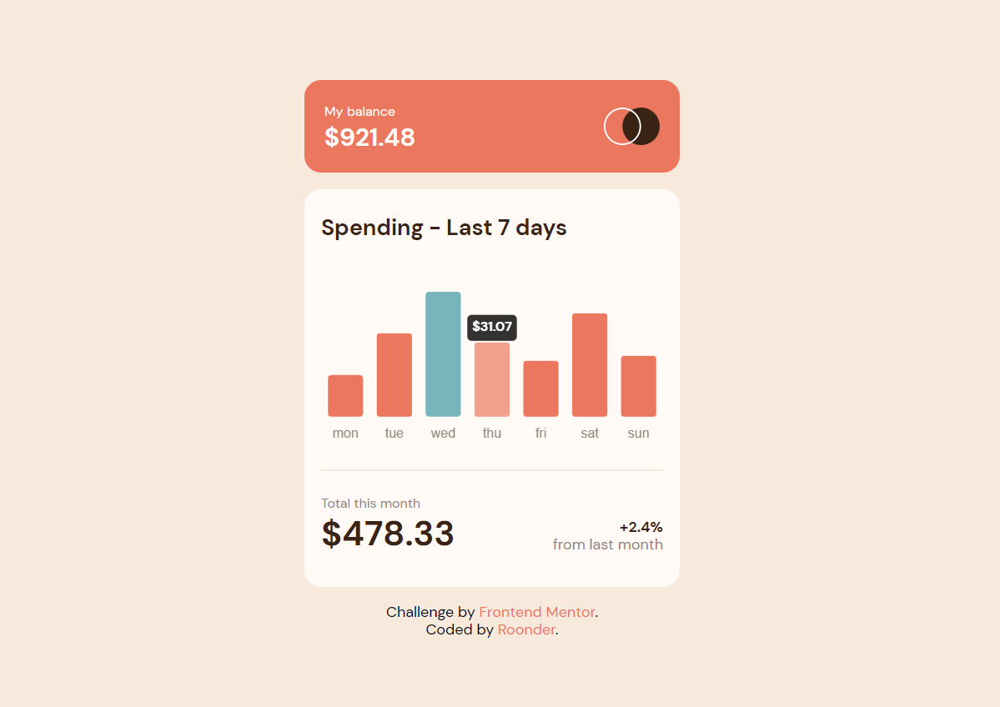

# Frontend Mentor - Expenses chart component solution

This is my solution to the [Expenses chart component challenge on Frontend Mentor](https://www.frontendmentor.io/challenges/expenses-chart-component-e7yJBUdjwt). A Frontend Project focused on improving our skills on designing and adding functional options to our future websites or apps.

## Table of contents

- [Overview](#overview)
  - [The challenge](#the-challenge)
  - [Screenshot](#screenshot)
  - [Links](#links)
- [My process](#my-process)
  - [Built with](#built-with)
  - [What I learned](#what-i-learned)
  - [Continued development](#continued-development)
  - [Useful resources](#useful-resources)
- [Author](#author)
- [Acknowledgments](#acknowledgments)

**Note: Delete this note and update the table of contents based on what sections you keep.**

## Overview

### The challenge

Users should be able to:

- View the bar chart and hover over the individual bars to see the correct amounts for each day
- See the current day’s bar highlighted in a different colour to the other bars
- View the optimal layout for the content depending on their device’s screen size
- See hover states for all interactive elements on the page
- **Bonus**: Use the JSON data file provided to dynamically size the bars on the chart

### Screenshot

### Links

- Solution URL: (https://github.com/Roonder/expenseschart_component)
- Live Site URL: (https://roonder-expenses.netlify.app/)

## My process

 - This was a challenging project in terms of my JavaScript skill. I wanted to test some new library I found (Chart.js) and set up the chart asked, using the JSON provided.
 - It was a really good process, using fetch() to consume the JSON and executing all the scripts inside the promise to show up the chart. In terms of design, it is a really
 - beautiful project, minimalist and able to improve with animations and whole HUD to add more context on it.

### Built with

- Semantic HTML5 markup
- CSS custom properties
- SASS - (https://sass-lang.com/)
- Flexbox
- CSS Grid
- Mobile-first workflow
- JavaScript
- Node.js - Gulp dependencies (https://gulpjs.com/)
- Chart.js - JavaScript Library (https://www.chartjs.org/)

### What I learned

I re-learned some semantic HTML5 that is always handy to use. Made sure to practice a lot of my CSS (SASS) knowledge, and practice my poor understanding on Promises and doing some
fetch() to the JSON file. Besides, I understood the functionality of the Chart.js library being able to set up this data on a functional chart.

### Continued development

I want to keep improving on the use of Chart.js, Promises, working with JSONs and being able to improve the interface of this project using more tools on the future.

### Useful resources

- [Chart.js Documentation](https://www.chartjs.org/docs/latest/) - Without the documentation, I couldn't set up the initial part of my charts.
- [Frontend Mentor - Expenses chart component solution](https://github.com/allyson-s-code/expense-chart-component) - Without this repository of this incredible coder, I couldn't understand how to use the tooltips and set up the whole chart, with the looks and more.

## Author

- LinkedIn - [Juliam Aponte (Roonder)](https://www.linkedin.com/in/roonderdev/)
- Frontend Mentor - [@Roonder](https://www.frontendmentor.io/profile/Roonder)
- GitHub - [@Roonder](https://github.com/Roonder)

## Acknowledgments

I have to acknowledge to Allyson's great skills, and code. She was the inspiration I had to keep working with the Chart.js library and not using another method to solve this problem.
If you're working with Chart.js as well, be free to take a look on my code and her code, and compare to decide which solution seems to work better for you. Remember that everything
depends on your solution approach!